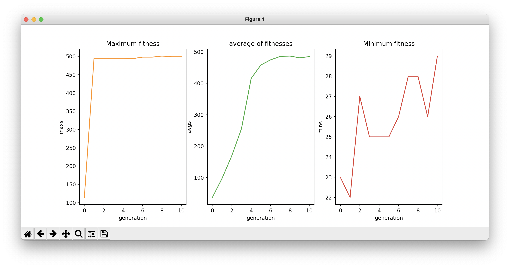

# Snail jumper
This is a neuroevolution project that utilizes evolutionary algorithms to generate neural networks (related to the players) parameters that eventually learn to play the game.
 

## Neuroevolution
### The Neural Network
The file nn.py is where I implemented the neural network (the weights and biases initializations, activation function(s), and feed forward). As mentioned before, each player (created by the evolutionary algorithm and together they form a whole generation) is associated with a neural network (with its specific parameters).
### The Evolutionary Algorithm
The file evolution is where I implemented the evolutionary algorithm of this project. Different steps of the evolutionary algorithm such as new population generation, new population selection and ... are implemented in this section and different combinations of selection method, mutation, and crossover are tried out and implemented (some have been commented because the combination didn't work so well).
### Learning Curve
The file drawer.py simply plots the learning curves. The picture below shows an example of the result of this code.

  

## The Game
The graphics and the general parts of this game was implemented by <a href="https://github.com/SoroushMehraban">Soroush Mehraban</a> (The neuroevolution part and the sections above were implemented by <a href="https://github.com/taratt">me</a>). 
